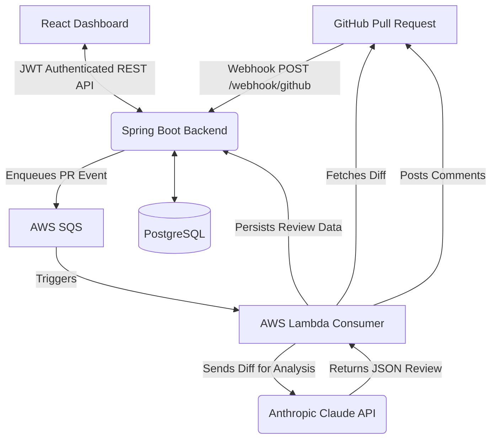

# CodeReview CI


CodeReview CI is a fully automated, AI-powered code review assistant. It hooks into your GitHub pull requests, triggers an AWS SQS queue, and processes the diff using Anthropic's Claude to post structured, insightful code review comments back to the PR.

## Features

- **Automated AI Code Review:** Analyzes pull request diffs using Anthropic's Claude.
- **Asynchronous Processing:** Utilizes AWS SQS and Lambda for scalable processing.
- **Dashboard UI:** Manage configurations and view review histories via a React frontend.

## Architecture Diagram



## Setup Instructions

### 1. Prerequisites
- Docker & Docker Compose
- AWS Account (for SQS and Lambda)
- GitHub OAuth App (for authentication)
- GitHub App / Webhook configured (for PR events)
- Anthropic API Key

### 2. Local Development (Docker)
Ensure you have Docker installed. Run the following to start PostgreSQL, Redis, and the Spring Boot backend:

```bash
docker-compose up --build
```

### 3. Environment Variables
Create a `.env` file or export the following variables:
- `GITHUB_CLIENT_ID`
- `GITHUB_CLIENT_SECRET`
- `GITHUB_WEBHOOK_SECRET`
- `JWT_SECRET`
- `AWS_ACCESS_KEY_ID`
- `AWS_SECRET_ACCESS_KEY`
- `ANTHROPIC_API_KEY` (used by Lambda)

### 4. Components
- **`code-review-ci/`**: Spring Boot application acting as the webhook receiver and REST API.
- **`lambda-consumer/`**: AWS Lambda function fetching the PR diff and integrating with Claude.
- **`react-dashboard/`**: Front-end React UI built with Vite.
- **`github-action/`**: Example GitHub Action composite workflow for consumers.

## Live Dashboard
[Live URL Placeholder](https://example.com)

## Contributing
Contributions are always welcome! Please feel free to submit a Pull Request.
